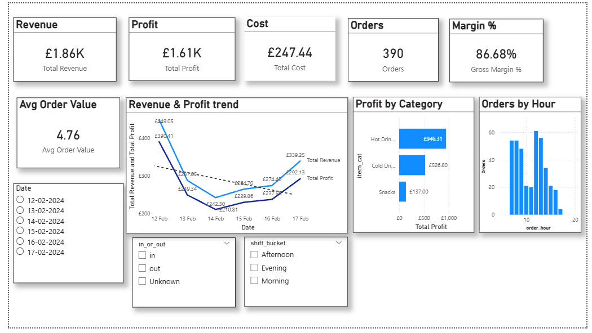
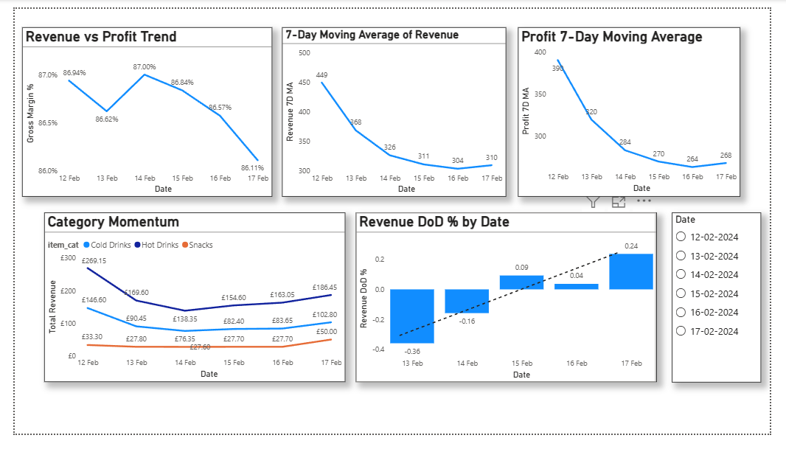
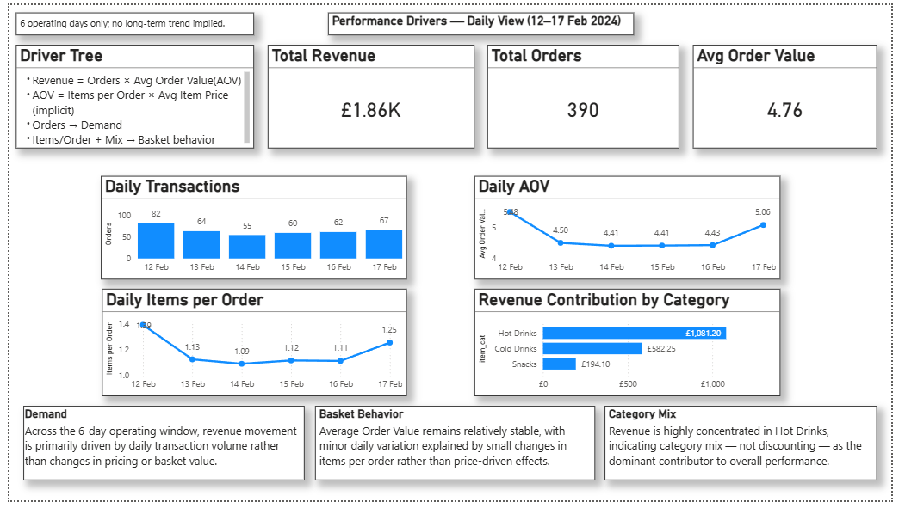

# Coffee Shop End-to-End Analytics

This project demonstrates a complete end-to-end business analytics workflow using a real-world coffee shop dataset.  

The objective of this project is to demonstrate an end-to-end analytics workflow that transforms raw operational data into executive-ready insights, with a focus on identifying revenue drivers, understanding cost structure, and distinguishing demand-led versus basket-led performance.

---

## Project Overview

The analysis focuses on understanding:
- What drives revenue performance
- Whether performance is demand-led or basket-led
- How product mix influences overall results

The project intentionally avoids overfitting trends due to a limited operating window and emphasizes honest, defensible analysis.

---

## Data Source

- Dataset: Coffee Shop Sample Data  
- Source: https://www.kaggle.com/datasets/viramatv/coffee-shop-data  
- Operating period: 12 Feb 2024 – 17 Feb 2024 (6 days)

The raw dataset includes transactional sales data along with supporting tables for items, recipes, ingredients, inventory, and operations.

---

## Tools and Workflow

### Excel
- Raw data validation and cleaning  
- Costing model and data enrichment  
-- An analysis-ready fact table (`sales_enriched`) was created and reused consistently across SQL, Python, and Power BI

### SQL
- Typed fact model  
- KPI definitions and aggregations  
- Analytical validation of metrics

### Python
- Exploratory data analysis (EDA)  
- Driver validation and hypothesis checks  
- Cross-verification of insights

### Power BI
- Executive dashboard  
- Performance storytelling  
- Clear separation of demand, basket behavior, and category mix

---

## Key Business Insights

- Revenue movement is primarily driven by transaction volume rather than pricing changes.
- Average Order Value (AOV) remains relatively stable, with minor variation explained by changes in items per order.
- Revenue is highly concentrated in Hot Drinks, making product mix a dominant performance driver.
- Due to the short operating window, no long-term trend assumptions were made.

---

## Dashboard Preview

### Executive Overview

### Trends and Momentum

### Daily Drivers

---

## Repository Contents

- CoffeeShop_Raw_Data.xlsx – original dataset snapshot  
- CoffeeShop_Excel_Cleaning_Costing_v1.1.xlsx – data cleaning and costing model  
- CoffeeShop_Sales_Enriched_Cleaned_v1.0.csv – analysis-ready fact table  
- CoffeeShop_SQL_Fact_Model_and_KPIs_v1.0.sql – SQL analytical model  
- CoffeeShop_Python_EDA_and_Driver_Analysis_v1.0.ipynb – Python analysis  
- CoffeeShop_PowerBI_Executive_Dashboard_v1.0.pbix – final dashboard  

---

## Notes on Data Quality

- Some raw transactions were excluded due to missing or invalid product mappings.
- All KPIs are calculated on validated and enriched data only.
- The analysis prioritizes correctness and transparency over artificial completeness.

---

## Author

Saket  
MBA (Business Analytics)  
End-to-End Analytics using Excel, SQL, Python, and Power BI

